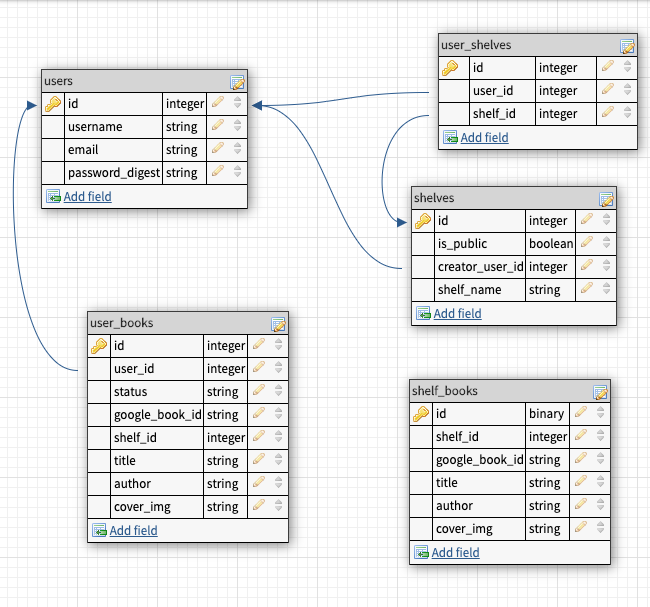

# UpReads
- UpReads is a book discovery app with a social justice tilt. Instead of having these collections burried, they will be front and center on the home page. The concept is inspired by images of bookshelf recommendations circulating on social media in this time of social consciousness raising. Instead of only sharing images, subject matter expects can create shelves that can be saved by other users, who can track their progress towards reading them. Individuals can also create their own shelves for personal use. Featured shelves in this release represent 

## Deployed App
- https://damp-oasis-30141.herokuapp.com/
- Test credentials: 

	|Username|Password|
	|-|-|
	|1testuser | 1testuser|

## Technologies
- React, Express, PSQL

## User Stories
- user can see featured book shelves on home page
- user can search for a specific book or author etc via search page
- user can click on a specific book to see more details
- user can create an account
- user can log in
	- user can save public/featured book shelves to their profile
	- use can create an empty book shelf
	- user will have a default shelf on register
	- user can add a book to an existing shelf
	- user can re-name a book shelf they created
	- user can delete a book shelf they create
	- user can delete a book from shelf they create

## Stretch Stories
- User can see star ratings for a given book
- Button tabs on search to allow for advanced search by author, title, etc.
- user can also tap a shelf category on the search page to view public user-created book shelves from that category
    - this will query the backend and then google books
	- will probably want a loading graphic
- user can change a book shelf they created from public to private and vice versa

## CRUD Routes
|User Story|Route|
|-|-|
|View featured collections on home page|`GET api/v1/books/home`|
|View shelf|`GET api/v1/shelf/:id`|
|View a single book|`GET api/v1/books/:id`|
|Add a shelf|`POST api/v1/shelf`|
|Edit a shelf|`PUT api/v1/shelf/:id`|
|Delete a shelf|`DELETE api/v1/shelf/:id`|
|Add a book to a shelf|`POST api/v1/books/user/:shelf_id/:id`|
|Delete a book from a shelf|`DELETE api/v1/books/user/:shelf_id/:id`|
|Save public shelf to profile|`POST api/v1/userShelf/:shelf_id`|
|Create an account|`POST api/v1/auth/register`|
|View log in page|`GET api/v1/auth/login`|
|Log in|`POST api/v1/auth/login`|
|Log out|`GET api/v1/auth/logout`|
## Trello Board
- [Trello](https://trello.com/b/biDiylz8/upreads)

## Wireframes

- The initial design was for a mobile app. 
- It has been implemented for web and will be followed by a mobile app release later.

## Database Diagrams

## Implementation
- `yarn add` or `npm install` for package dependencies.
- You will need your own `SECRET_KEY` for your db and `GOOGLE_KEY` for the Google Books API used in this project. Your google key will need to be requested through Google directly.