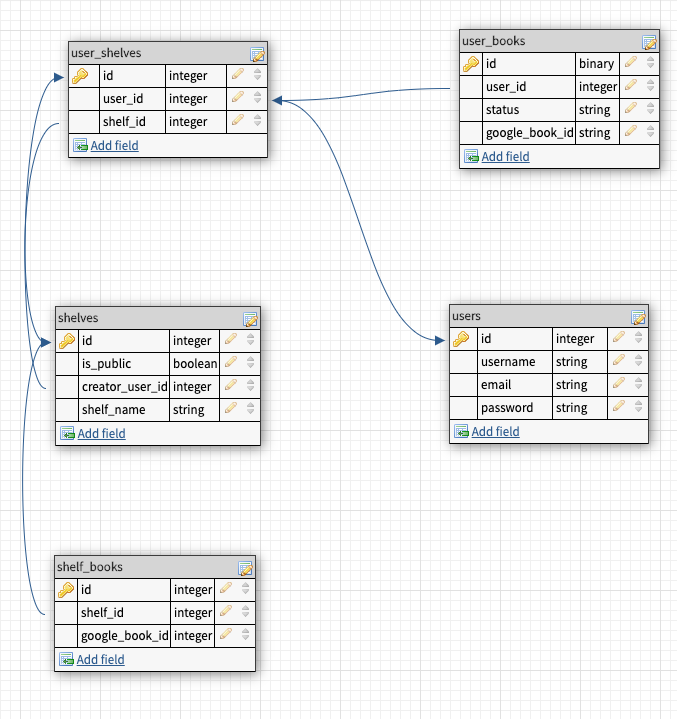

# UpReads
- UpReads is a mobile book discovery app with a social justice tilt. Instead of having these collections burried, they will be front and center on the home page. The concept is inspired by images of bookshelf recommendations circulating on social media in this time of social consciousness raising. Instead of only sharing images, subject matter expects can create shelves that can be saved by other users, who can track their progress towards reading them.

## Technologies
- React Native, Express, PSQL

## User Stories
- user can see featured book shelves on home screen - swipe to see more
- user can search for a specific book or author etc through search bar on search tab, which will be powered by google books api
- user can create an account
- user can log in
	- user can save public/featured book shelves to their profile
	- use can create an empty book shelf
	- user can add a book to an existing shelf
	- user can re-name a book shelf they created
	- user can delete a book shelf from their profile

## Stretch Stories
- Button tabs on search to allow for advanced search by author, title, etc.
- user can also tap a shelf category on the search page to view public user-created book shelves from that category
    - this will query the backend and then google books
	- will probably want a loading graphic
- user can change a book shelf they created from public to private and vice versa
- user can delete a book shelf they create
## Trello Board
- [Trello](https://trello.com/b/biDiylz8/upreads)

## Wireframes

## Database Diagrams

## Anticipated Challenges
- I'm sure I'll run into unexpected differences between React and React Native. 
- I've attempted to research core functionality (CRUD) upfront to limit major surprises/setbacks.

## Implementation
- `yarn add` or `npm install` for package dependencies.
- You will need your own `SECRET_KEY` for your db and `GOOGLE_KEY` for the Google Books API used in this project. Your google key will need to be requested through Google directly.